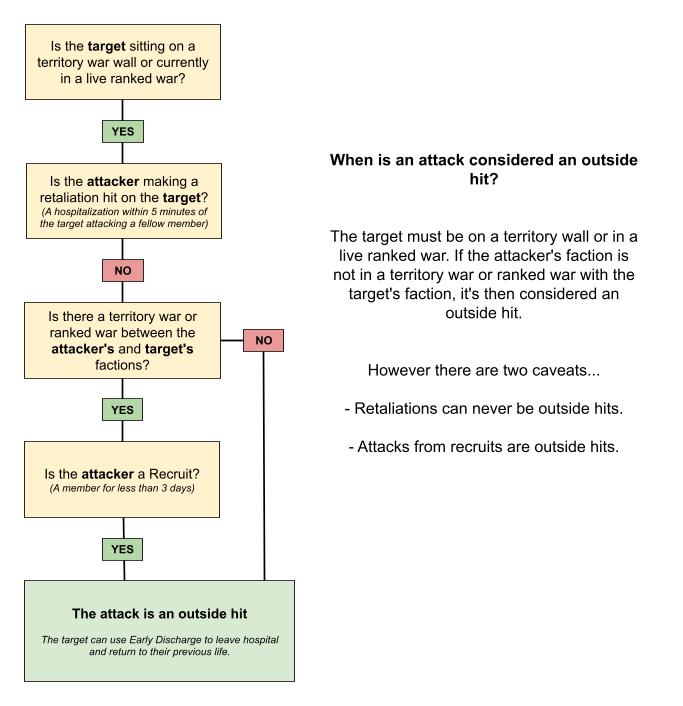

> Faction

# 14.帮派

提交人：contr4l_[2893026]  
提交日期：2023-04-16  
原文地址：https://wiki.torn.com/wiki/Faction

相关链接：
- [有组织犯罪](OC.md)
- [这里](../../quicklink/18.-ling-tu/README.md)
- [ED](EarlyCharge.md)
- [多人运动](OC.md)
- [帮派挑战](Faction_Challenge.md)
- [论坛](../12.-lun-tan.md)
- [军械库](Armory.md)
- [HOF](../13.-ming-ren-tang.md)
- [这里](RankWar.md)
- [名人堂](../13.-ming-ren-tang.md)
- [这里](DirtyBomb.md)
- [战争](Warfare.md)
- [肮脏炸弹](DirtyBomb.md)
- [链条](Chain.md)

---

帮派是一群在同一名称和旗帜下一起玩《撕裂》的玩家，他们对游戏有着共同的看法。帮派由一个领导者和一个可选的联合领导者领导；除了集体犯罪和战争努力（通过[多人运动](OC.md)和[战争](Warfare.md)）之外，他们还允许共享资源（通过[军械库](Armory.md)）。

## 创建帮派
帮派是《撕裂》中最受欢迎的活动之一。开始一个新的帮派需要花费1000美元\*当前游戏中的帮派数量，尽管在[论坛](../12.-lun-tan.md)的帮派买卖主题中可以用更少的钱购买一个帮派。一个全新的帮派将有5,000个敬意，并将设在一个棚子里，提供最多5个成员的空间。这可以在[升级面板](#升级面板)中进一步升级。

一个帮派的成功可以通过它目前的尊重总额和它所拥有的升级来衡量。要查看游戏中最好的帮派，请到报纸上的[HOF](../13.-ming-ren-tang.md)。

### 当领袖AFK时...
如果一个帮派的领导人不活跃超过30天，领导权将自动转移给共同领导人。如果该帮派没有共同领袖，它将被转移到过去24小时内在线时间最长的成员。

### 申请过程

- 玩家现在最多可以同时拥有10个帮派的**申请**。这意味着他们可以自由地同时申请几个帮派，大大提高了他们迅速进入一个帮派的机会。这解决了向一个帮派申请，等待答复，然后再向另一个帮派申请的繁琐过程。

- 帮派领导人将不再收到每份申请的新闻或事件垃圾邮件。相反，我们已经实施了一个单独的通知系统，提醒有权限的人注意待定的申请。

- 玩家可以在申请发出后的任何时候编辑他们的申请，或者通过相关的帮派资料撤回他们。

- 一旦申请被接受，所有其他相关的申请将被删除。因此，作为一个帮派领导人，你看到的所有申请都是来自现在可以加入的玩家。

- 如果一个申请被拒绝，该玩家将不能在7天内再次申请。这些7天的重新申请限制可以由帮派通过切换 "允许申请 "关闭和打开来覆盖。

- 如果申请没有被接受或拒绝，72小时后就会过期。

## 帮派战争
这些是各帮派为了获得尊重、攀登[名人堂](../13.-ming-ren-tang.md)和得到撕裂社区的认可而使用的功能/玩法。

### 面子
尊重是大多数帮派都会为之奋斗和牺牲的东西。它可以用来向撕裂社区展示你的帮派有多好，它可以用来作为吹嘘的权利，也可以用来升级帮派的特质。获得和失去尊重的方式有很多。

#### 获取面子

- 对其他玩家进行攻击和[连锁](#连击)。在短时间内连续攻击被称为连锁，是获得尊重的最有效方式。

- 你也可以通过拥有[领土](#地盘)，每天积累尊重。

- 大多数帮派都会进行[有组织犯罪](OC.md)，目的是为了获得尊重，以及在这个过程中获得一些金钱。它们的难度和所需的成员数量各不相同。

- 电视台公司的特别项目 "宣传 "允许员工将工作点数用于为他们所在的帮派赢得尊重。帮派新闻日志也会有这方面的记录。

#### 失去面子

- 当一个帮派被[肮脏炸弹](DirtyBomb.md)击中时，它将失去大量的尊重，并受到其他一些影响。

- 当一个帮派的成员被攻击时，该帮派将失去攻击者所获得的25%的尊敬。

### 连击

查看有关[链条](Chain.md)的主要文章

锁链是一种战争工具，旨在补充两个派系之间的战争。连续击中你的帮派以外的玩家将建立一个 "连锁"，随着连锁的建立，逐渐赢得更多的尊重--偶尔也会达到 "奖励 "击中，获得大量额外的尊重。

- 链条必须通过花费尊重来解锁。一旦一个帮派完成了既定长度的连锁，它就可以解锁下一个长度的连锁。这些购买是不可退还的。

- 连锁的前10次攻击必须在5分钟内完成。除此之外，每一个连续的打击必须在5分钟内完成，否则链条将进入其冷却状态。

- 随着连锁的进展，获得的尊重将逐渐增加--按对数计算。在连锁的13个（目前是11个）可能的点上，指定为 "奖励命中"，一个命中将产生一个大的平坦的尊重奖励。

- 一旦链子断裂，它将进入冷却状态，在链子中每击中一次，冷却时间为10秒（例如，10次击中的链子为100秒）。

Chaining在2017年被完全重新设计，并在11月作为更大的Warring 2.0升级的第一个更新揭开面纱。关于这个问题的全部细节可以在连锁网页上找到。

### 突袭战

突袭是一种纯粹的破坏性战争形式，于[19年1月8日](https://www.torn.com/forums.php#/p=threads&t=16076707)发布。任何帮派都可以开始对另一帮派进行无限期的突袭，在此期间，只能从对手那里获取尊重，而不是赢得尊重。

在突袭期间，任何一方的攻击都会造成100%的尊重损失（相比之下，普通攻击造成的损失为25%）。

你从对方帮派获得的尊重将被添加到你帮派的突袭分数中。

与排名战和领土战一样，一旦突袭完成，突袭报告中会有完整的统计和图表。

#### 发起突袭

帮派必须有至少10名成员才能宣布突袭。

一个帮派每次只能与一个帮派开始突击行动。如果你的帮派参与了一次突袭，在当前的突袭停止之前，它将不能开始另一次突袭。然而，你的帮派可以同时被多个帮派突袭。

注意：如果你的帮派开始突袭，它将迫使任何当前的链子进入其冷却状态，所以链子应该在你的帮派宣布突袭之前完成或开始。

#### 取消突袭

一旦过了24小时，得分最高的帮派（获得最多的尊重）就可以选择 "停止 "突袭。

如果满足以下任何条件，失败的帮派也可以停止突袭：

- 任何一方在72小时内没有进行攻击

- 胜利方的成员少于10人[1](#cite_1)。

得分最低的帮派也可以在任何时候选择投降，然而这只是通知对方帮派你希望突击行动结束。他们可以选择接受你的投降并停止，或者无视它并继续。

交易的和平条约将在约定的时间内停止并阻止突袭。

在极少数情况下，一个帮派的总尊重可能达到0，在这种情况下，该帮派会被[摧毁](#帮派销毁)。

### 帮派销毁

当一个帮派的尊重度为零时，他们将被永久地摧毁。帮派不会被完全删除，但会进入不可恢复的死亡状态--这意味着帮派无法被访问，但其资料--显示其名称、形象和前任领导人--将被永远保留。

破坏后，该派系的所有成员将被删除，任何没有借出的库存将被转移到领导者那里，包括金钱和积分。

### 地盘

关于获得领土的更多信息，请查看[这里](../../quicklink/18.-ling-tu/README.md)。

### 排位战
关于排名战的更多信息，请查看[这里](RankWar.md)。

### 外部打击 vs 内部打击

外围撞击的标准如下所示：

在外部撞击次数过多后，球员可以获得[ED](EarlyCharge.md)的资格。[2](#cite_2)

## 多人运动面板
核心文章：[有组织犯罪](OC.md)

有组织犯罪小组允许规划有组织犯罪。**有组织犯罪**是由一个**帮派**的成员进行的团体活动，目的是为了获得现金和对该帮派的尊重，以及为参与的成员获得犯罪经验。

这个面板允许拥有适当权限的人计划和发起有组织犯罪，以及计划离开帮派的人取消他们自己的有组织犯罪。

## 升级面板

升级面板是帮派管理的核心和关键。它分为两个部分，核心分支和特殊升级分支。

- 核心分支的升级是不能撤销的，所以在选择这些时要小心。这包括成员能力、军械库升级、脏弹实验室、领土升级和连锁升级。

- 特殊升级分支是你可以选择你的特殊产品的地方，你可以从8个树的列表中选择最多6个树。这些可以立即换成另一种升级的 "装备"[3](#cite_3)。

### 军械库
| Upgrade          | Respect | Challenge                  |
|:----------------:|:-------:|:--------------------------:|
| Weapon Armory    | 1,000   | N/A                        |
| Armor Armory     | 1,412   | N/A                        |
| Temporary Armory | 3,067   | N/A                        |
| Medical Armory   | 3,067   | N/A                        |
| Drug Armory      | 6,662   | N/A                        |
| Booster Armory   | 6,662   | N/A                        |
| Point Storage    | 15,773  | N/A                        |
| Laboratory       | 105,027 | Acquire 25 faction members |

### 锁链

| Upgrade       | Max Chain Size | Respect | Challenge                 |
|:-------------:|:--------------:|:-------:|:-------------------------:|
| Chaining I    | 10             | 1,412   | N/A                       |
| Chaining II   | 25             | 2,173   | Achieve a chain of 10     |
| Chaining III  | 50             | 3,067   | Achieve a chain of 25     |
| Chaining IV   | 100            | 4,719   | Achieve a chain of 50     |
| Chaining V    | 250            | 6,662   | Achieve a chain of 100    |
| Chaining VI   | 500            | 10,251  | Achieve a chain of 250    |
| Chaining VII  | 1,000          | 15,773  | Achieve a chain of 500    |
| Chaining VIII | 2,500          | 22,265  | Achieve a chain of 1,000  |
| Chaining IX   | 5,000          | 34,258  | Achieve a chain of 2,500  |
| Chaining X    | 10,000         | 48,358  | Achieve a chain of 5,000  |
| Chaining XI   | 25,000         | 74,404  | Achieve a chain of 10,000 |
| Chaining XII  | 50,000         | 105,027 | Achieve a chain of 25,000 |

### 能力

| Upgrade | Max Chain Size | Respect | Challenge                         |
|:-------:|:--------------:|:-------:|:---------------------------------:|
| I       | 10             | 1,000   | N/A                               |
| II      | 15             | 1,412   | N/A                               |
| III     | 20             | 2,173   | Achieve a faction age of 10 days  |
| IV      | 25             | 3,067   | Achieve a faction age of 20 days  |
| V       | 30             | 4,719   | Achieve a faction age of 30 days  |
| VI      | 40             | 6,662   | Achieve a faction age of 40 days  |
| VII     | 50             | 10,251  | Achieve a faction age of 50 days  |
| VIII    | 65             | 15,773  | Achieve a faction age of 75 days  |
| IX      | 80             | 22,265  | Achieve a faction age of 100 days |
| X       | 100            | 34,258  | Achieve a faction age of 150 days |

### 领土

| Upgrade        | Max Chain Size | Respect | Challenge                      |
|:--------------:|:--------------:|:-------:|:------------------------------:|
| Territory I    | 1              | 1,295   | N/A                            |
| Territory II   | 2              | 1,678   | Hold 1 territory for 3 days    |
| Territory III  | 3              | 2,173   | Hold 2 territories for 3 days  |
| Territory IV   | 4              | 3,067   | Hold 3 territories for 3 days  |
| Territory V    | 5              | 3,972   | Hold 4 territories for 3 days  |
| Territory VI   | 6              | 5,144   | Hold 5 territories for 3 days  |
| Territory VII  | 7              | 6,662   | Hold 6 territories for 3 days  |
| Territory VIII | 8              | 8,628   | Hold 7 territories for 3 days  |
| Territory IX   | 9              | 12,180  | Hold 8 territories for 3 days  |
| Territory X    | 10             | 15,773  | Hold 9 territories for 3 days  |
| Territory XI   | 11             | 20,427  | Hold 10 territories for 3 days |
| Territory XII  | 12             | 26,453  | Hold 11 territories for 3 days |
| Territory XIII | 13             | 37,341  | Hold 12 territories for 3 days |
| Territory XIV  | 14             | 48,358  | Hold 13 territories for 3 days |
| Territory XV   | 15             | 62,625  | Hold 14 territories for 3 days |
| Territory XVI  | 16             | 81,100  | Hold 15 territories for 3 days |
| Territory XVII | 17             | 105,027 | Hold 16 territories for 3 days |

### 特殊分支

特别分支是你的所有派系成员都能获得的奖金。你可以将你的尊重分配给这些特殊分支。但要注意的是，特殊分支只能在设置后的72小时内取消，所以你不能不断改变你的特殊分支。此外，升级成本取决于该分支所处的槽位，第一个槽位的基本成本如下，随后的每个槽位的成本是前一个槽位的两倍（第一个槽位的升级成本为1000尊重，第二个槽位的成本为2000尊重，第三个槽位为4000尊重，等等）。

为了解锁更多的专业化分支，一个帮派必须同时拥有指定数量的升级活动。一旦达到解锁专业分支的要求，它将被永久解锁，即使该帮派目前拥有的升级总数低于指定数量。

#### 宽容

支部解锁二：20个升级

分支机构解锁三：45个升级

分支机构解锁四：75升级

分支机构解锁五：升级110

分支机构解锁六：150升级

如果你对旧的升级系统感兴趣，你可以在[这里](https://wiki.torn.com/wiki/Old_Faction_Upgrades)查看这些。

本节内容直接抄自哈雷[258120]的[帖子](https://www.torn.com/forums.php#/p=threads&t=15995252) 。

你可以在FIN[527880]和Franky[1529693]的这份[电子表格](https://docs.google.com/spreadsheets/d/13OqSfNjRfI_yHKTI8yHzuJODozhYCWN9uYLD7Bt5UuE/pubhtml)上找到更多关于你需要完成的所有挑战的信息。

Kivou[2000607]在YATA上的[尊重模拟器](https://yata.yt/faction/simulator/)也可以用来预测每个升级所需的尊重。

#### 坚守

主要的树木：

- 速度训练：增加速度训练馆的收益，最高可达10%。(每次升级1%)

- 力量训练：增加力量训练馆的收益，最高可达10%。(每次升级1%)

- 防御训练：增加防御训练馆的收益，最高可达10%。(每次升级1%)

- 灵巧训练：增加灵巧健身房的收益，最高可达10%。(每次升级1%)

次要树：

- 速度或力量上的额外5%。

- 防御或灵巧上的额外5%。

三级树：一个额外的5%的状态，取决于你之前选择的专业性。

总成本：249,498尊重（这是在10级时有两个分支，15级时有一个，20级时有一个）。

#### 侵略性

主要的树木：

速度：被动增加速度，最高可达20%。(每次升级1%)
力量：被动增加力量，最高可达20%。(每次升级1%)
二级树：

准确度：提高准确度，最高可达+2.0。(每次升级+0.2)
住院治疗：增加出院时间达50%。(每次升级5%)
伤害：增加所有伤害至10%。(每次升级1%)
总成本：563,249尊重

#### 远行

主树：旅行能力：增加旅行能力至10。 (每次升级1个)

次级树：

旅行费用：降低旅行费用达75%。（每次升级15%）。
狩猎：增加狩猎收入达30%。(每次升级3%)
康复费用：减少康复费用达20%。(每次升级2%)
海外银行业务：增加开曼岛利息的倍数，最高可达25%。(每次升级5%，这意味着你可以获得高达0.625%的利息，而不是基本的0.5%，这在7*石油钻井平台工作的特殊情况下进一步增加到0.675%)
总成本 320,921 尊重

#### 毅力

主树：住院时间：缩短所有医院的时间，最高可达25%。(每次升级1%)

二级树：

生命再生：每回合最多再生4%的生命。(每次升级0.2%)
复活：将复活的成本降低到25能量。( 每次升级为5)
医疗冷却时间：增加最多3小时的医疗冷却时间。(每次升级15米)
三级树：医疗效果：获得最多30%的额外医疗效果。(每次升级2%)

总成本：526,142尊重

#### 贪婪

主树：助推器冷却时间：增加高达24小时的助推器冷却时间。(每次升级1小时)

辅助树：

酒精效应：增加酒精的神经增益，最高可达50%。(每次升级5%)
糖果效果：增加来自糖果的快乐增益，最高可达50%。(每次升级5%)
能量饮料效果：从罐头中获得的能量增加到50%。(每次升级5%)
总成本：275,581英镑

#### 搞事能力

主树：犯罪：提供高达25%的犯罪技能和经验提升。(每次升级1%)

次要树种：

监禁时间：减少监狱时间达30%。(每次升级2%)
神经：增加最大的神经，最多可增加40个额外的神经。(每次升级1个)
三级树：胸部技能：增加胸部技能，最高可达50%。(每次升级5%)

四级树：破坏神经：降低神经胸围的成本至3。（每次升级1）。

总成本：593,993尊重

#### 压制

主要的树木：

防御：被动地增加防御，最高可达20%。(每次升级1%)
灵巧：被动增加灵巧度，最高20%。(每次升级1%)
二级树：

逃跑：在试图逃跑时增加灵巧度，最高可达500%。(每次升级50%)
最大生命值：增加最大生命值，最高可达20%。(每次升级1%)
总成本：500,004尊重

### 挑战

关于帮派挑战的更多信息，请查看[帮派挑战](Faction_Challenge.md)页面。

## 控制面板

这里是修改帮派概况、发送通讯、编辑用户权限和创建肮脏炸弹的地方。

### 给予用户

允许帮派领导人、共同领导人或任何被授予 "给钱 "和 "给分 "权限的人在 "给用户 "面板中看到帮派所有成员的金钱和积分余额，并给成员金钱或积分。当成员捐赠金钱/积分时，这些余额会增加，如果被给予金钱/积分则会减少。发薪日 "功能不会影响金钱余额。领袖或共同领袖可以将余额调整为任何数值；这只改变会员显示的余额，没有其他影响。会员可以在军械库页面上看到自己的个人余额。

你现在可以使用一个URL请求数据来预填 "给用户 "标签上的名称和金额字段，以给予金钱或积分，或将金钱或积分加入用户的余额。这将是这样的格式：

给钱：

- https://www.torn.com/factions.php?step=your#/tab=controls&giveMoneyTo=1636201&money=100000

- https://www.torn.com/factions.php?step=your#/tab=controls&addMoneyTo=1636201&money=100000

给点数：

- https://www.torn.com/factions.php?step=your#/tab=controls&givePointsTo=1636201&points=100000

- https://www.torn.com/factions.php?step=your#/tab=controls&addPointsTo=1636201&points=100000

### 帮派交流

**帮派[论坛](../12.-lun-tan.md)**：帮派论坛是你与你的成员交谈、发布想法、帮派服务和报价的地方。它也是发布帮派最新信息的主要场所，一个良好的论坛对于帮派的成功至关重要。所有的帮派成员都可以创建主题并在其中发帖，但只有某些帮派的工作人员可以删除不属于他们的主题或制作贴纸。

**帮派聊天框**：这是帮派成员实时交谈的地方，在连锁经营或寻求帮派方面的帮助时很有用。

**通讯**：一些帮派工作人员可以发送通讯，通常，这些信件有关于帮派的重要信息，通常最好关注这些信息。

### 支付日

允许有送钱权限的成员同时向多个帮派成员送钱。

### 申请

在这里，你可以查看、接受或拒绝已申请加入你的帮派的用户的申请。从管理标签中撤回申请的用户将显示 "撤回状态"。

### 成员

在这里，你可以找到你派系中所有成员的完整名单，并相应地改变他们的位置。

### 职位

只有领导或共同领导可以创建职位和编辑每个职位的权限。

新成员默认会收到一个 "新兵 "职位，对帮派的访问是有限的。72小时后，成员会收到帮派的默认职位，领导人和联合领导人可以重新命名。

!> TODO: 修改此处表格样式

| Level | Permission |
|  ---  |    ---     |
| Green | Medical Item Usage |
|       | Booster Item Usage |
|       | Drug Item Usage |
|       | Energy Refill Usage |
|       | Temporary Item Loaning |
|       | Weapon & Armor Loaning |
|       | Item Retrieving |
|       | Organized Crimes |
|       | Faction API Access |
| Orange| Item Giving |
|       | Money Giving |
|       | Points Giving |
|       | Forum Management |
|       | Application Management |
|       | Red | Kick Member |
|       | Balance Adjustment |
|       | War Management |
|       | Upgrade Management |
| Black | Newsletter Sending |
|       | Announcement Changes |
|       | Description Changes |

#### 实验室

在实验室里，你可以建造一个肮脏的炸弹。[这里](DirtyBomb.md)有更多的细节。

### 删除

一个帮派的领袖，也只有领袖可以选择删除他们的帮派。但是，如果该帮派有超过100,000人的尊重，则不能这样做。[4](#cite_4)

帮派每小时删除一次，只有在这之后，领袖才能够永久地离开帮派。

## 历史说明

- [不活跃的帮派领袖没有正确晋升](https://www.torn.com/forums.php#/p=threads&t=16114682&to=19599870)--将每天不活跃的帮派领袖替换为过去24小时内在线时间最长的联合领袖或成员

- 以前，焰火台公司有一个特殊功能，允许用户花费工作点数来减少对敌方派系的尊重。在2015年5月，当公司的特殊功能被赋予重大改革时，这一特殊功能被移除。

- 以前，玩家需要成为一个派系的成员四天，才能通过 "给玩家 "功能获得现金或积分。

- *如果你失去或放弃了一块领土，你将在7天内无法再次尝试占领该领土。*- 截至2019年12月，这一规则已被删除。

## 参考资料

!> TODO：增加跳转

1. Chedburn, Raid Ceased by Losing Faction  (14/02/22)
2. #184
3. War Mode
4. bogie, Private communication (25/11/21).