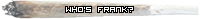

>  Drugs
> 
提交人: superxu[2848855]  
提交日期: 2023-04-09  
原文地址: https://wiki.torn.com/wiki/Drug  

# 8.嗑药

**药物**是一种你可以服用的物品，以获得一系列的特殊效果，用完你的药物冷却时间。

## 关键细节

- 你不能在前一种药物的作用下服用另一种药物。你可以通过鼠标悬停在药物冷却（杂草）图标上检查还剩下多少时间。
- 任何使你的幸福感超过你的最大值的效果，都会在每一刻钟重置回你的最大值，以小时为单位（即XX:00/15/30/45）。
- 通过服用药物（如 Ketamine, PCP, and Speed）获得的被动状态增加可能会在后遗症期间慢慢减少。
- Opium会消除你所有的住院时间，除非是辐射中毒造成的。
- 除了爱液之外，每种毒品服用50次都有荣誉条。
- 爱液与其他药物不同，只在情人节前后可用。
- 过量服用可能会增加冷却时间。
- 城市商店不出售毒品；但可以在国外购买。
- Ketamine可以通过在5星或更高的动物园或农场中使用5个工作点获得。它是唯一可以通过公司获得的毒品。
- 你的成瘾程度并**不**影响你吸毒过量的机会。

## 药物种类

<table class="wikitable table table-striped table table-striped prettyTable">
<tbody><tr>
<th class="header" colspan="2">药物和效果
</th></tr>
<tr>
<th class="subheader">效果 &amp; 冷却
</th>
<th class="subheader">过量影响(od)
</th></tr>
<tr>
<td colspan="2"><a href="/wiki/Cannabis" title="Cannabis">Cannabis</a>
</td></tr>
<tr>
<td>
<ul><li>增加(crime)搞事成功率</li>
<li>- 20% 力量（Strength）</li>
<li>- 25% 防御(Defense)</li>
<li>- 35% 速度(Speed)</li>
<li>+ 2-3 Nerve</li>
<li><b>冷却时间:</b> 60-90 分钟</li>
<li>2 成瘾点(addiction points)</li></ul>
</td>
<td>
<ul><li>- 100% 能量(Energy) &amp; Nerve</li>
<li>住院: 300-330 分钟</li>
<li>'Spaced Out' honor bar</li></ul>
</td></tr>
<tr>
<td colspan="2"><a href="/wiki/Ecstasy" title="Ecstasy">Ecstasy</a>
</td></tr>
<tr>
<td>
<ul><li>双倍 Happy</li>
<li><b>冷却时间:</b> 200-230 分钟</li>
<li>20 成瘾点(addiction points)</li></ul>
</td>
<td>
<ul><li>- 100% 能量(Energy) &amp; Happy</li></ul>
</td></tr>
<tr>
<td colspan="2"><a href="/wiki/Ketamine" title="Ketamine">Ketamine</a>
</td></tr>
<tr>
<td>
<ul><li>- 20% 力量（Strength） &amp; Speed</li>
<li>+ 50% 防御(Defense)</li>
<li><b>冷却时间:</b> 45-60 分钟</li>
<li>8 成瘾点(addiction points)</li></ul>
</td>
<td>
<ul><li>- 100% 能量(Energy), Nerve &amp; Happy</li>
<li>住院: 1,000 分钟</li>
<li>额外冷却时间 (24-27 hours)</li>
<li>-20% 力量（Strength） &amp; Speed</li></ul>
</td></tr>
<tr>
<td colspan="2"><a href="/wiki/LSD" title="LSD">LSD</a>
</td></tr>
<tr>
<td>
<ul><li>+ 30% 力量（Strength）</li>
<li>+ 50% 防御(Defense)</li>
<li>- 30% 速度(Speed) &amp; 灵巧(Dexterity)</li>
<li>+ 50 能量(Energy)</li>
<li>+ 200-500 Happy</li>
<li>+ 5 Nerve</li>
<li><b>冷却时间:</b> 400-450 分钟</li>
<li>21 成瘾点(addiction points)</li></ul>
</td>
<td>
<ul><li>- 100% 能量(Energy) &amp; Nerve</li>
<li>- 50% Happy</li>
<li>- 30% 速度(Speed) &amp; 灵巧(Dexterity)</li></ul>
</td></tr>
<tr>
<td colspan="2"><a href="/wiki/Opium" title="Opium">Opium</a>
</td></tr>
<tr>
<td>
<ul><li>+30% 防御(Defense)</li>
<li>移除所有住院时间，并将生命补充到50%</li>
<li>Opium 也受到帮派医疗效果加成影响 <a href="/wiki/Faction#Fortitude" title="Faction">Fortitude</a> branch.</li>
<li><b>冷却时间:</b> 120-180 分钟</li>
<li>10 成瘾点(addiction points)</li></ul>
</td>
<td>
<ul><li>N/A</li></ul>
</td></tr>
<tr>
<td colspan="2"><a href="/wiki/PCP" title="PCP">PCP</a>
</td></tr>
<tr>
<td>
<ul><li>+ 20% 力量（Strength） &amp; 灵巧(Dexterity)</li>
<li>+ 250 Happy</li>
<li><b>冷却时间:</b> 260-400 分钟</li>
<li>26 成瘾点(addiction points)</li></ul>
</td>
<td>
<ul><li>- 100% 能量(Energy), Nerve &amp; Happy</li>
<li>Hospital: 1,620 分钟</li>
<li>- 10 x (current level) 速度(Speed) (permanent)</li></ul>
</td></tr>
<tr>
<td colspan="2"><a href="/wiki/Shrooms" title="Shrooms">Shrooms</a>
</td></tr>
<tr>
<td>
<ul><li>+ 500 Happy</li>
<li>- 20% 所有战斗属性(Battle stats)</li>
<li>- 25 能量(Energy) (caps at 0)</li>
<li><b>冷却时间:</b> 182-237 分钟</li>
<li>6 成瘾点(addiction points)</li></ul>
</td>
<td>
<ul><li>- 100% 能量(Energy), Nerve &amp; Happy</li>
<li>Hospital: 100 分钟</li></ul>
</td></tr>
<tr>
<td colspan="2"><a href="/wiki/Speed" title="Speed">Speed</a>
</td></tr>
<tr>
<td>
<ul><li>- 20% to 灵巧(Dexterity)</li>
<li>+ 20% 速度(Speed)</li>
<li>+ 50 Happy</li>
<li><b>冷却时间:</b> 250 - 352 分钟</li>
<li>14 成瘾点(addiction points)</li></ul>
</td>
<td>
<ul><li>住院: 150 分钟</li>
<li>- 6 x (当前等级) 力量（Strength） &amp; Defense (permanent)</li>
<li>100% 丢失所有能量(Energy), Nerve &amp; Happiness</li></ul>
</td></tr>
<tr>
<td colspan="2"><a href="/wiki/Vicodin" title="Vicodin">Vicodin</a>
</td></tr>
<tr>
<td>
<ul><li>+ 25% 所有战斗属性(Battle stats)</li>
<li>+ 75 Happy</li>
<li><b>冷却时间:</b> 240-360 分钟</li>
<li>14 成瘾点(addiction points)</li></ul>
</td>
<td>
<ul><li>- 150 Happy</li></ul>
</td></tr>
<tr>
<td colspan="2"><a href="/wiki/Xanax" title="Xanax">咸蛋(xan)</a>
</td></tr>
<tr>
<td>
<ul><li>+ 250 能量(Energy)</li>
<li>+ 75 Happy</li>
<li>- 35% 所有战斗属性(Battle stats)</li>
<li><b>冷却时间:</b> 360-480 分钟</li>
<li>35 成瘾点(addiction points)</li></ul>
</td>
<td>
<ul><li>- 100% 能量(Energy), Nerve and Happy</li>
<li>住院: 5000 分钟</li>
<li>额外冷却时间 &amp; 增加成瘾点 (~24-25 hours / 3 Xanax)</li></ul>
</td></tr>
<tr>
<td colspan="2"><a href="/wiki/Love_Juice" title="Love Juice">Love Juice</a>
</td></tr>
<tr>
<td>
<ul><li>攻击和复活的能量花费减少10 E</li>
<li>+ 50% 速度(Speed)</li>
<li>+ 25% 灵巧(Dexterity)</li>
<li>只能在“情人节”当天使用 <a href="/wiki/Current_Events" title="Current Events">event</a></li>
<li><b>冷却时间:</b> ~300 分钟</li>
<li>50 成瘾点(addiction points)</li></ul>
</td>
<td>
<ul><li>无</li></ul>
</td></tr></tbody></table>

## 成瘾影响

每种类型的毒品都会给你带来不同程度的成瘾性。在你有特定程度的成瘾性时，会出现成瘾效果--而不仅仅是在你有药物冷却的时候。你服用的每一种药物都会提供一些成瘾性（除非你正在阅读 "热火鸡 "一[书]('https://wiki.torn.com/wiki/Books')，即使大脑图标还没有出现。需要注意的是，虽然这两个词在《撕裂》中经常交替使用，但 "上瘾 "和 "战斗属性debuff "并不是一回事--尽管这个debuff是衡量你的上瘾程度的一个简单方法，而无需去戒毒所。

在上瘾到一定程度时，大脑图标会出现在你的个人图标中，表明对你的战斗属性的削弱程度。你的毒瘾越重，大脑出现的红色就越多。

除了战斗力减弱外，随着你成瘾程度的加深，还会有更多的负面后果开始出现：

- 你在公司的效率将开始下降（这不影响董事）。这是从你第一次吸毒开始的，而不仅仅是当大脑图标出现时！
- 你将被踢出任何你所接受的教育。在一个具有最大容忍度的派别中，这发生在提供6-7%战斗力减弱的成瘾水平左右。这种影响可以在10*[夜店]('https://wiki.torn.com/wiki/Nightclub')工作时得到缓解。
- 你可能会失去进入无毒品[健身房](3.-jian-shen-fang.md)--体育科学实验室的权利。如果你使用的Xanax和Ecstasy的总和超过150，就会发生这种情况。
- 你可能会被迫使用药物，以便能够进入健身房训练。
虽然多年来一直有传言，但毒瘾并不影响有组织犯罪的成功。[**[1]**](#link-1 ":id=ref-1")

有可能通过以下方式消除这些长期影响：

- 去瑞士的康复中心
- 等待毒瘾自然消退。每天凌晨3:30 TCT时，20个成瘾点会自然消除。
- 把工作点数花在特价商品上：邮轮公司的 "R and R"，花店的 "Herbal Cleansing"，夜总会的 "Suppression"（这些都可以在5*公司中找到）。每一个工作点可以去除1个成瘾点。
- 使用书籍：Milk Yourself Sober，完成后可消除大量的毒瘾。
- 使用书籍：热火鸡，获得31天无毒瘾。
在确定每种毒品的数量会迫使人们接受教育之前，还需要做更多的测试。

## 过量服用(OD)

任何时候服用药物（除了鸦片和爱的汁液，它们不能过量），都有很小的机会过量服用该药物。当这种情况发生时，玩家将收到一个事件，说他们已经过量，并遭受该药物的过量影响。

每种药物都有不同的过量效果（详见上文），通常都有一个延长的药物冷却时间。每种药物也有不同的过量几率（例如，cannabis的过量几率极低，而摇头丸的过量几率相对较高）。

成瘾性、服药频率、服药次数、自上次服药后的时间等，都不会影响服药过量的机会。

帮派升级"Toleration"分支中的 "Overdosing"特技可以降低过量的几率，每次升级可以使你过量的几率降低3%，最高为30%。在具有被动 "Toleration"特技的7*夜总会中也可以减少50%。

吸食cannabis过量的几率为1/2500（在cannabis日活动期间为1/500）[**[2]**](#link-2 ":id=ref-2")。

## 相关奖章

服用每种药物（不包括Love Juice）50份时有一个荣誉栏，服用大麻过量时有一个荣誉栏：

<table class="wikitable table table-striped table table-striped prettyTable">
<tbody><tr>
<th class="header" colspan="3">Drug Related Awards
</th></tr>
<tr>
<th class="subheader">Image
</th>
<th class="subheader">Name
</th>
<th class="subheader">Requirements
</th></tr>
<tr>
<td data-sort-value="Spaced Out"></td>
<td>Spaced Out</td>
<td>Overdose on Cannabis
</td></tr>
<tr>
<td data-sort-value="Who&#39;s Frank?"></td>
<td>Who's Frank?</td>
<td>Use 50 Cannabis
</td></tr>
<tr>
<td data-sort-value="I Think I See Dead People"></td>
<td>I Think I See Dead People</td>
<td>Use 50 Shrooms
</td></tr>
<tr>
<td data-sort-value="Party Animal"></td>
<td>Party Animal</td>
<td>Use 50 Ecstasy
</td></tr>
<tr>
<td data-sort-value="Acid Dream"></td>
<td>Acid Dream</td>
<td>Use 50 LSD
</td></tr>
<tr>
<td data-sort-value="Painkiller"></td>
<td>Painkiller</td>
<td>Use 50 Vicodin
</td></tr>
<tr>
<td data-sort-value="Horse Tranquilizer"></td>
<td>Horse Tranquilizer</td>
<td>Use 50 Ketamine
</td></tr>
<tr>
<td data-sort-value="The Fields Of Opium"></td>
<td>The Fields Of Opium</td>
<td>Use 50 Opium
</td></tr>
<tr>
<td data-sort-value="Crank It Up"></td>
<td>Crank It Up</td>
<td>Use 50 Speed
</td></tr>
<tr>
<td data-sort-value="Angel Dust"></td>
<td>Angel Dust</td>
<td>Use 50 PCP
</td></tr>
<tr>
<td data-sort-value="Free Energy"></td>
<td>Free Energy</td>
<td>Use 50 Xanax
</td></tr></tbody></table>

## 补丁历史

<dl><dt><a rel="nofollow" class="external text" href="https://www.torn.com/forums.php#/p=threads&amp;t=16228266">Patch list #193&#160;: 25/05/21</a></dt></dl>
<ul><li>Changed behavior for the Rehab slider movement for when the user doesn't have enough money.</li></ul>
<dl><dt><a rel="nofollow" class="external text" href="https://www.torn.com/forums.php#/p=threads&amp;t=16212979">Patch list #181&#160;: 23/02/21</a></dt></dl>
<ul><li>Changed Opium to only recover up to 50% of maximum life but is now affected by medical effectiveness.</li>
<li>Changed Opium to provide +30% defense for its reduced duration of 2-3 hours.</li></ul>
<dl><dt><a rel="nofollow" class="external text" href="https://www.torn.com/newspaper.php#!/articles/2044">Love Juice Potency Reduced</a></dt></dl>
<ul><li>Love Juice will only provide a reduction of 10 energy when attacking or reviving.</li></ul>
<dl><dt><a rel="nofollow" class="external text" href="https://www.torn.com/forums.php#/p=threads&amp;t=16149316">Patch list #133&#160;: 17/03/20</a></dt></dl>
<ul><li>Changed high drug addiction gym hospitalization to not trigger if the user is under attack.</li></ul>
<dl><dt><a rel="nofollow" class="external text" href="https://www.torn.com/forums.php#/p=threads&amp;t=16143518">Patch list #128&#160;: 11/02/20</a></dt></dl>
<ul><li>Changed Valentine's Day Love Juice event to also reduce reviving costs by -15 energy</li></ul>
<dl><dt><a rel="nofollow" class="external text" href="https://www.torn.com/forums.php#/p=threads&amp;t=16123717">Patch list #113&#160;: 15/10/19</a></dt></dl>
<ul><li>Added 'Crimes' link after using Cannabis.</li></ul>
<dl><dt><a rel="nofollow" class="external text" href="https://www.torn.com/forums.php#/p=threads&amp;t=16120202">Patch list #112&#160;: 24/09/19</a></dt></dl>
<ul><li>Added gym link after using Ecstasy.</li></ul>
<dl><dt><a rel="nofollow" class="external text" href="https://www.torn.com/forums.php#/p=threads&amp;t=16086852">Patch list #84&#160;: 05/03/19</a></dt></dl>
<ul><li>Changed drugs to prevent their usage while in hospital for radiation poisoning.</li></ul>
<dl><dt><a rel="nofollow" class="external text" href="https://www.torn.com/forums.php#/p=threads&amp;t=16034281">Patch list #32&#160;: 13/02/18</a></dt></dl>
<ul><li>Removed events from successful (non-overdose) drug taking.</li></ul>

## 参考链接

1. [↑](#ref-1 ":id=link-1") Chedburn, [Issue regarding unclear wording on merit upgrades Bug Report关于勋章升级措辞不明确的问题 Bug报告](https://www.torn.com/forums.php#/p=threads&t=16113588).
2. [↑](#ref-2 ":id=link-2") Chedburn, [Of All The Nerve!](https://www.torn.com/newspaper.php#!/articles/2279).