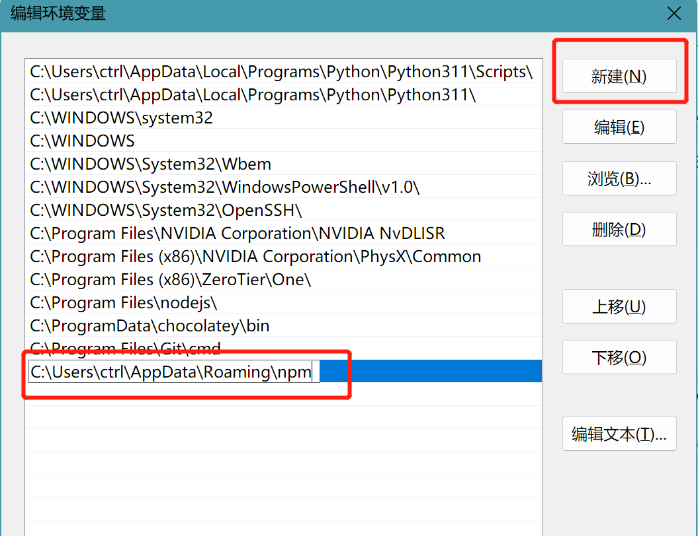
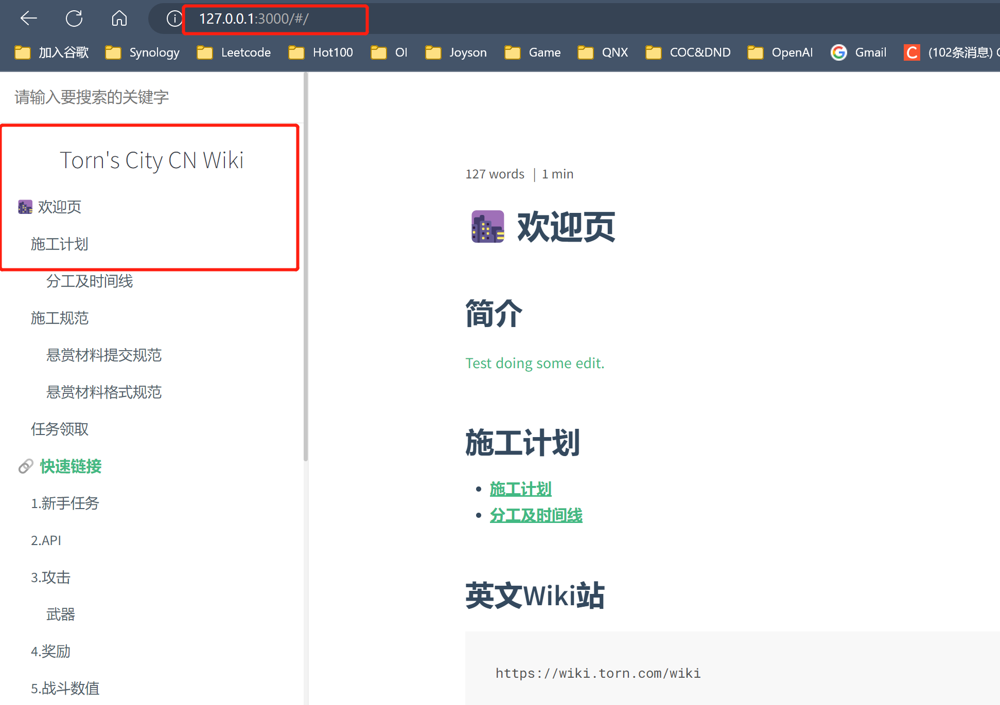

> 作者：contr4l_

# docsify基本功能介绍
> 一个神奇的文档网站生成器。  

关于Docsify的介绍请见[docsify](https://docsify.js.org/#/zh-cn/)，在此不再赘述，读者可以简单理解为这个工具将编排有序的文档组织为一个网站并对外提供服务。

## docsify的安装
### Node.js 安装
官方下载地址为[Node.js](https://nodejs.org/en)，通常建议下载`LTS`版本。  


注意安装过程中如果有是否将node/npm添加至环境变量的选项需要勾上。 `Add xxx to environment PATH`

确认安装结果：`Win+R`输入`powershell`并回车，打开`Windows PowerShell`，输入`npm -v`，输出结果应如下所示。  
```bash
PS C:\Users\ctrl> npm -v
9.5.0
# 根据用户的node.js版本不同，数字可能有所差异
```

### docsify安装
docsify实际上是受npm管理的一个框架，因此我们需要使用npm来安装docsify。  
```bash
npm i docsify-cli -g
# PS C:\Users\ctrl> npm i docsify-cli -g
# added 204 packages in 33s
# 16 packages are looking for funding
#   run `npm fund` for details

# 如果是linux系统，请使用sudo npm i docsify -g
```

将docsify的路径加入系统环境变量中后，一路确定关掉设置窗口。  

> 注意此处环境变量的路径要根据自己系统中docsify.ps1所在的位置确定，每个人是不一样的 

  

  

  

使用管理员权限打开powershell并输入`set-ExecutionPolicy RemoteSigned`增加自定义脚本执行权限。
```powershell

# PS C:\WINDOWS\system32> set-ExecutionPolicy RemoteSigned
# 执行策略更改
# 执行策略可帮助你防止执行不信任的脚本。更改执行策略可能会产生安全风险，如 https:/go.microsoft.com/fwlink/?LinkID=135170
# 中的 about_Execution_Policies 帮助主题所述。是否要更改执行策略?
# [Y] 是(Y)  [A] 全是(A)  [N] 否(N)  [L] 全否(L)  [S] 暂停(S)  [?] 帮助 (默认值为“N”): 

# **输入A然后回车**
```

执行`docsify`测试结果  
```powershell
PS C:\WINDOWS\system32> docsify
Usage: docsify <init|serve> <path>

Commands:
  docsify init [path]      Creates new docs                         [aliases: i]
  docsify serve [path]     Run local server to preview site.        [aliases: s]
  docsify start <path>     Server for SSR
  docsify generate <path>  Docsify's generators                     [aliases: g]

Global Options
  --help, -h     Show help                                             [boolean]
  --version, -v  Show version number                                   [boolean]
```

### 使用docsify生成网页
```powershell
# 切换到gh-pages分支
PS C:\Users\ctrl\Desktop\TornCity\TornCity-CnWiki> git checkout gh-pages
Switched to a new branch 'gh-pages'
branch 'gh-pages' set up to track 'origin/gh-pages'.

# docsify生成网页
PS C:\Users\ctrl\Desktop\TornCity\TornCity-CnWiki> docsify serve ./

Serving C:\Users\ctrl\Desktop\TornCity\TornCity-CnWiki now.
Listening at http://localhost:3000

# 最后在浏览器中访问http://localhost:3000查看效果
```
  

