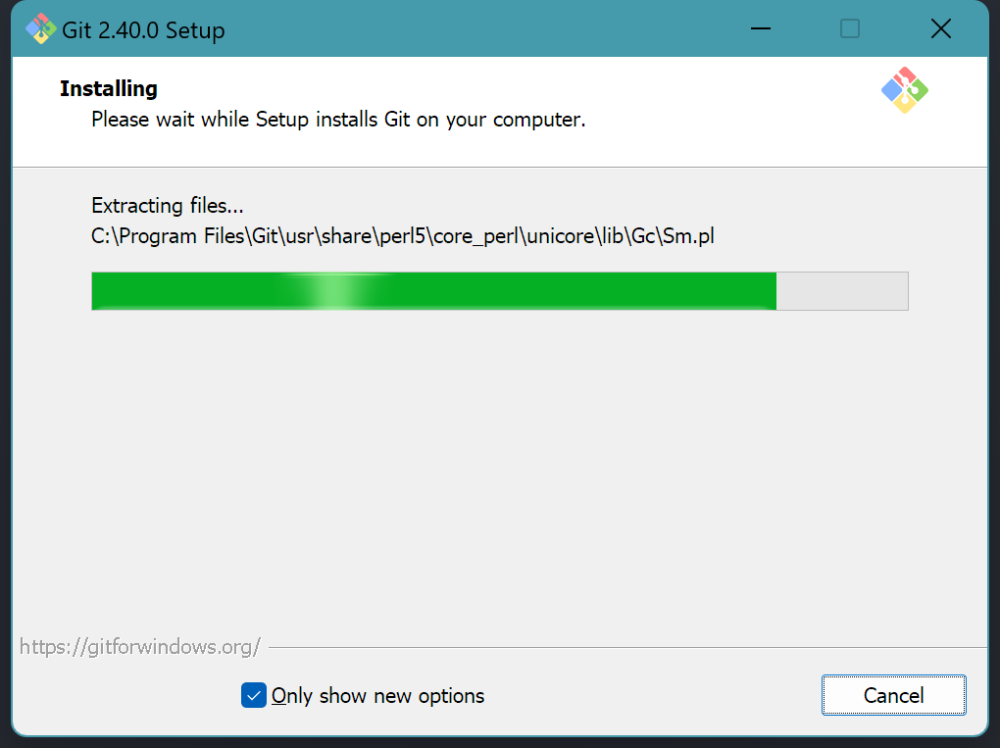
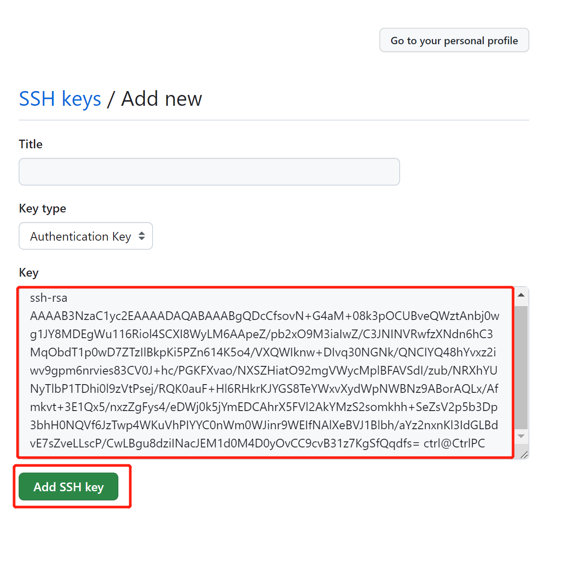
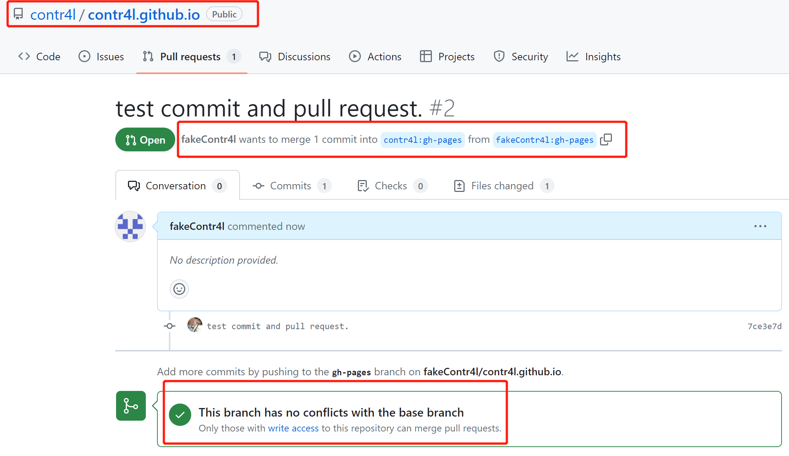

> 作者：contr4l_

# Git及Github基本功能介绍  
Git以及github是目前可以说是流行最广的代码管理方案（类似的方案有时代的眼泪之SVN、同样基于git的gitlab、gitee等等），在本教程中，将手把手教读者完成git的安装、github仓库的拉取、代码的修改及提交等事务，为拥抱开源打下基础。

## Git的安装
git作为一个命令行程序，提供了一系列代码下载、提交、分支管理的功能，其下载地址为：[Git Download](https://git-scm.com/downloads)，对于Windows，通常选择**Standalone Installer：64-bit Setup**即可（如果是非常老旧的32bit系统，也可选择32-bit Setup）。

<figure><figcaption></figcaption></figure>

此时按下`Win+R`，输入`powershell`并运行，在窗口中输入`git -v`，应当出现如下字样：

```bash
PS C:\Users\ctrl> git -v
git version 2.40.0.windows.1
```
!> 1. 版本信息可能根据安装的git版本有所变化  
2. 如果提示报错，需要考虑git安装过程是否出现问题或是是否将git.exe所在的路径正确添加进了系统的环境变量

## Github的注册、添加SSH Key  
首先需要[注册github账号](https://github.com/signup)，在此请自行解决与github/google的网络连接问题（一般情况下github直连是顺畅的，但在某些教育网系统中毛病颇多，与地区网络服务供应商有关）。  

> 现在的注册页面真是酷炫，谷歌是伟大的公司233

现在你可以在github登录自己的账号。

在我们进行`git clone`之前，需要做一项很重要的事情，那就是将本机的`SSH key`放进自己的`github account`，操作步骤如下：  

```bash
# 1. 在powershell中，输入ssh-keygen.exe，并一路回车
# 此处我增加了-f选项是为了不覆盖已生成的公钥
PS C:\Users\ctrl> ssh-keygen.exe -f github
Generating public/private rsa key pair.
Enter passphrase (empty for no passphrase):
Enter same passphrase again:
Your identification has been saved in github
Your public key has been saved in github.pub
The key fingerprint is:
SHA256:JJ+NVRVXLj2aWTGQj+5Jx6edEnpQG146uqvMmbR9uhI ctrl@CtrlPC
The key's randomart image is:
+---[RSA 3072]----+
|            .o=++|
|           . . +o|
|      . . .   +oo|
|       + =   +=+.|
|        S . ++*  |
|         E . O o.|
|         .. * =oo|
|        +.=o *...|
|         Bo*B .  |
+----[SHA256]-----+
# 2. 继续输入cat ~/.ssh/id_rsa.pub
PS C:\Users\ctrl> cat ~/.ssh/id_rsa.pub
ssh-rsa ****** ctrl@CtrlPC
# 3. 将屏幕上ssh-rsa开头的一长串字符串复制下来
# 4. 在github页面，依次点击右上角自己头像-Settings-SSH and GPG keys-New SSH key
# 5. 将刚才复制的一长串内容粘贴进Key的文本框，并点击Add SSH key，Title可以留空
```

<figure><figcaption></figcaption></figure>

<figure><figcaption></figcaption></figure>

## Github仓库的拉取  
现在你需要访问我们的[wiki所在的repo](https://github.com/contr4l/contr4l.github.io)。

首先你需要将这个仓库`fork`到你的仓库内，这是能够进行修改并提交的基础。  

!> 注意选项`clone main branch only`一定要取消勾选！因为我们是基于gh-pages分支进行开发的。  
<figure><figcaption></figcaption></figure>


现在你可以看到`contr4l.github.io`已经位于你的名下了，如下图所示。  
<figure><figcaption></figcaption></figure>

接下来我们进行代码拉取，首先找到SSH的代码拉取地址，如下图所示，然后在`powershell`中输入`git clone {刚才你复制的以.git结尾的地址}`。  
<figure><figcaption></figcaption></figure>


```bash
PS C:\Users\ctrl> git clone git@github.com:fakeContr4l/contr4l.github.io.git
Cloning into 'contr4l.github.io'...
remote: Enumerating objects: 242, done.
remote: Counting objects: 100% (242/242), done.
remote: Compressing objects: 100% (145/145), done.
remote: Total 242 (delta 69), reused 202 (delta 35), pack-reused 0Receiving objects:  67% (163/242), 1.63 MiB | 39.00 Ki

Receiving objects: 100% (242/242), 1.69 MiB | 45.00 KiB/s, done.
Resolving deltas: 100% (69/69), done.
```  
此时你当前目录下会多出一个`contr4l.github.io`为名的文件夹，就是我们的工作目录。

## 切换分支并进行编辑、提交
首先我们需要将默认的main分支切换到我们的工作分支`gh-pages`  
```bash
cd contr4l.github.io
git checkout gh-pages
# 提示应当如下：
# Switched to branch 'gh-pages'
# Your branch is up to date with 'origin/gh-pages'.
```
然后我们要建立起自己的repo和原始repo的追踪关系，并且保持本地代码是最新的
```bash
# 增加一个名为upstream的上游git
git remote add upstream git@github.com:contr4l/contr4l.github.io.git
# 将上游的内容获取下来
git fetch upstream
# remote: Enumerating objects: 101, done.
# remote: Counting objects: 100% (101/101), done.
# remote: Compressing objects: 100% (26/26), done.
# remote: Total 63 (delta 8), reused 63 (delta 8), pack-reused 0
# Unpacking objects: 100% (63/63), 857.91 KiB | 53.00 KiB/s, done.
# From github.com:contr4l/contr4l.github.io
#  * [new branch]      gh-pages   -> upstream/gh-pages
#  * [new branch]      main       -> upstream/main

# 将上游最新的变更同步到本地
git pull upstream gh-pages
# From github.com:contr4l/contr4l.github.io
#  * branch            gh-pages   -> FETCH_HEAD
# Updating e820fac..b08386a
# Fast-forward
# ...
```

!> 注意每次在进行修改前，都要执行`git pull upstream gh-pages`的操作，以免本地的修改与远端发生冲突。

接下来你可以在本地编辑器中，对这个repo进行任意修改，通过docsify的实时预览确保修改符合自己的预期。

最后需要将修改提交到自己的repo上，操作如下：
```bash
# 首先确保自己在contr4l.github.io的根目录下
pwd
# Path
# ----
# C:\Users\ctrl\contr4l.github.io

# 然后将所有修改加入暂存区
git add .

# 执行提交，并附加上提交的信息（commit message
git commit -m "{双引号内部填写修改的备注，如translate armor page}"

# 执行推送，目标是自己的repo的gh-pages分支
git push origin gh-pages
# PS C:\Users\ctrl\contr4l.github.io> git push  
# Enumerating objects: 5, done.  
# Counting objects: 100% (5/5), done.  
# Delta compression using up to 12 threads  
# Compressing objects: 100% (3/3), done.  
# Writing objects: 100% (3/3), 381 bytes | 381.00 KiB/s, done.  
# Total 3 (delta 2), reused 0 (delta 0), pack-reused 0  
# remote: Resolving deltas: 100% (2/2), completed with 2 local objects.  
# To github.com:fakeContr4l/contr4l.github.io.git  
#    e820fac..7ce3e7d  gh-pages -> gh-pages
```
最后向上游分支提交`pull request`，申请将自己的修改合入发布分支，此处要注意几点：
1. 原始分支和目标分支都要选择gh-pages（如果你本地在其他分支进行了操作，根据实际情况确定）
2. 一定是从自己的仓库创建`pull request`而非contr4l的仓库  

<figure><figcaption></figcaption></figure>  

<figure><figcaption></figcaption></figure>  

接下来你可以看到在contr4l的仓库的`pull request`列表出现了你的新的PR申请，如下图所示

<figure><figcaption></figcaption></figure>  

> 此时一是要检查下方的修改内容是否和自己修改的一致  

> 二是要确认`no conflict`，存在冲突的原因可能是你的修改和已经存在的某个修改重叠了，需要在本地解决冲突再进行提交  

> VsCode解决冲突只需要选择`use your commit` or `use remote commit`即可，非常容易