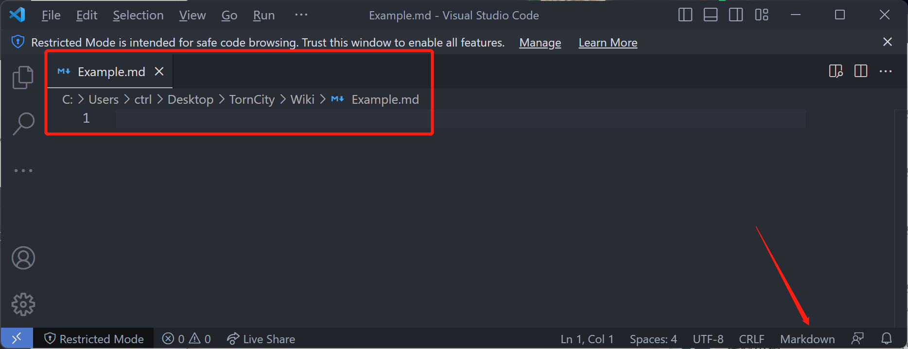

>  作者：contr4l_

# VsCode安装、插件安装、Markdown预览

### VsCode简介 <a href="#vscode-jian-jie" id="vscode-jian-jie"></a>

VsCode是MicroSoft发布的**文本编辑器**，以其功能免费、丰富的插件支持、可定制化程度高等特点逐渐成为新生代程序员最喜欢的文本编辑器之一。（与之竞争的包括学习曲线陡峭的VIM，有License问题的Sublime Text，UI界面相对来说不够现代化的Eclipse或NotePad++）

### Markdown简介 <a href="#markdown-jian-jie" id="markdown-jian-jie"></a>

Markdown本身是一种语法规则，我们可以简单地理解成，当我们按照一定的格式输入文本，强大的渲染引擎可以将它显示为我们期望的显示效果，例如加粗、下划线、引用、章节段落层级、超链接、代码块等等。

它相比起传统的Office操作，对文字工作者最大的帮助在于可以使工作者**专注于内容本身**而非格式，同时在很大程度上**降低了编辑过程中鼠标的使用频率**。

在本教程中，我们基于在VsCode中安装Markdown插件来满足我们需要一个支持Markdown语法的、支持实时预览的文本编辑器。

### VsCode安装 <a href="#vscode-an-zhuang" id="vscode-an-zhuang"></a>

[下载地址](https://code.visualstudio.com)，支持Windows/Linux/MacOS

双击运行会显示如下窗口，（通常我会建议使用者不对界面进行汉化）

<figure><figcaption></figcaption></figure>

常用的快捷键：

* Ctrl+N, 新建文件
* Ctrl+S，保存文件
* Ctrl+Shift+P，进入功能选择
* Ctrl+P，进入文件选择
* Ctrl+B，打开/关闭侧边栏
* Ctrl+F，文本内搜索
* Ctrl+Shift+F，全局搜索

### 插件安装 <a href="#cha-jian-an-zhuang" id="cha-jian-an-zhuang"></a>

在VsCode中，插件（Extension）是最重要的功能之一，它通过即插即用的方式为平凡的文本编辑器提供了大量额外的功能，可以极大地为带有特定目的的工作者提供效率上的提升，同时所有感兴趣的开发者可以创造自己的插件并发布到Market中，大部分是开源且免费的功能，少数可能提供额外的收费功能（如代码补全神器Tabnine）。

在VsCode界面，按下`Ctrl+Shift+X`进入插件界面，如下图所示，INSTALLED部分就是当前本机已经安装的插件。

<figure><figcaption></figcaption></figure>

在上方搜索框中，输入Markdown并回车，我们可以查询当前插件市场中有的Markdown相关的插件，我们选择`Markdown All in One`并点击Install执行安装。（此处由于我已经完成了安装，此处显示的是Uninstall ，即卸载😄）

<figure><figcaption></figcaption></figure>

### Markdown实时预览 <a href="#markdown-shi-shi-yu-lan" id="markdown-shi-shi-yu-lan"></a>

我们首先按下`Ctrl+N`新建一个文档并保存命名为Example.md（VsCode可以根据文件的后缀名确定当前文件内容应该按照什么语法来执行高亮）

<figure><figcaption></figcaption></figure>

我们按照Markdown语法输入如下文本：

```markdown
# 一级标题

## 二级标题

此处为内容

`此处为行内代码`

**加粗效果**

~~删除效果~~

> 引用格式的内容
```

接下来按下`Ctrl+Shift+P`，出现功能选择框：

<figure><figcaption></figcaption></figure>

我们输入`Preview`，并选择`Markdown: Open Preview to the Side`

> 此处我的判断有误，VsCode原生支持Markdown，不需要安装插件也可以，不过插件功能是值得专门介绍的。

<figure><figcaption></figcaption></figure>

会得到如下图所示的效果

<figure><figcaption></figcaption></figure>

而后我们可以任意在左侧方框中编辑内容，实际渲染的效果会在右侧同步显示出来。

### 其他格式的导出 <a href="#qi-ta-ge-shi-de-dao-chu" id="qi-ta-ge-shi-de-dao-chu"></a>

如果我们想要得到一个如同右侧显示效果的文件（如pdf），我们可以安装如下图所示的插件，然后同样通过`Ctrl+Shift+P`搜索相关的功能进行导出。

<figure><figcaption></figcaption></figure>

<figure><figcaption></figcaption></figure>

这样我们可以得到如下的文件

<figure><figcaption></figcaption></figure>

### 其他 <a href="#qi-ta" id="qi-ta"></a>

关于VsCode和Markdown还有大量的玩法，如对LaTeX的支持，手动输入公式，和html语法的联动等等，感兴趣的朋友可以继续搜索知识学习。
